<picture>
  <source media="(prefers-color-scheme: dark)" srcset="./dark.svg">
  <source media="(prefers-color-scheme: light)" srcset="./light.svg">
  
</picture>
# Hi, I'm Harshit Raj 👋

### Computer Science Engineering Student | Data Science • AI/ML • GenAI • LLMs • RAG • Agentic AI • Full-Stack

📍 Bangalore, India  
🎓 B.E. Computer Science & Engineering @ BMSIT  
📊 CGPA: 9.06 | 2024–2028

I build practical, data-driven AI systems with a focus on **Data Science, Machine Learning, Generative AI, LLMs, RAG, and Agentic AI**.

I enjoy turning AI concepts into working applications while developing the software-engineering skills needed to build complete AI products.

**Open to internship opportunities in Data Science, AI/ML, and Full-Stack Development.**

---

## 🧠 About Me

- 🎓 3rd-year Computer Science Engineering student at **BMS Institute of Technology & Management**
- 📈 Focused on **Data Science and Machine Learning**
- 🤖 Building with **Generative AI, LLMs, RAG, and Agentic AI**
- 🔗 Working with **LangChain, LangGraph, Google ADK, and MCP**
- 🌐 Developing frontend skills with **HTML, CSS, JavaScript, and React**
- 🧩 Strengthening **Data Structures & Algorithms**
- 🗄️ Working with **SQL, PostgreSQL, MySQL, and MongoDB**
- 💻 Interested in building practical **AI-powered applications**
- 🚀 Open to **Data Science, AI/ML, and Full-Stack internships**

---

# 🛠️ Tech Stack

### 🐍 Programming


### 📊 Data Science & Machine Learning


### 🤖 Generative AI / LLM / Agentic AI


### 🔎 Retrieval / Vector Tools


### 🌐 Frontend


### 🗄️ Databases


### 🔧 Tools


---

# 🚀 Featured Projects

## 🔬 AI Research Synthesizer

An autonomous **deep-research agent** built around a multi-node LangGraph workflow.

**Tech:** Python • LangGraph • LangChain • Groq • Tavily • Streamlit

### Highlights

- Decomposes complex research queries into focused sub-questions
- Performs live web research using Tavily
- Maintains state across workflow nodes
- Uses conditional routing to evaluate retrieval results
- Automatically retries failed searches
- Synthesizes retrieved information into structured Markdown reports
- Preserves source URLs
- Streams workflow execution through the Streamlit interface

🔗 **Repository:**  
https://github.com/Harshitraj123/AI-Research-Synthesizer

---

## 🧠 AI Research & Deep Agent Assistant

An AI-powered research assistant built around **Deep Agents and LangGraph** for multi-step research workflows.

**Tech:** Python • LangChain • LangGraph • Deep Agents • Groq • Tavily • Streamlit • Pydantic

### Highlights

- Agentic planning and task decomposition
- Web research through Tavily
- Specialized research subagents
- Reusable skills-based context
- Virtual file handling
- Structured outputs using Pydantic
- Thread-based memory and checkpointing

🔗 **Repository:**  
https://github.com/Harshitraj123/AI-Research-Deep-Agent

---

## 👴 Elder Care Assistant

A secure **multi-agent elderly-care assistant** designed to support medication workflows, appointment coordination, and caregiver alerts.

**Tech:** Google ADK • MCP • FastAPI • Python

### Highlights

- Multi-agent orchestration
- Medication specialist and appointment scheduler agents
- MCP-based tool integration
- Security checkpoint
- Prompt-injection detection
- Human-in-the-loop caregiver review
- Appointment scheduling workflows
- Caregiver alert mechanisms

🔗 **Repository:**  
https://github.com/Harshitraj123/elderly-care-assistant

---

## 🎥 AI Video Intelligence Assistant

An AI-powered system for understanding video content through transcription, summarization, insight extraction, and RAG-based conversational Q&A.

**Focus:** LLMs • RAG • Video Intelligence

🔗 **Repository:**  
https://github.com/Harshitraj123/AI-video-intelligence-assistant

---

## 📊 Telecom Customer Churn Prediction

An end-to-end supervised machine learning project for predicting telecom customer churn.

**Tech:** Python • Pandas • Scikit-learn • Streamlit • Joblib • Pytest

### Highlights

- Exploratory Data Analysis
- Leakage-safe preprocessing
- Logistic Regression
- Decision Tree
- Random Forest
- Model comparison
- Classification metrics
- ROC-AUC evaluation
- Model persistence
- Streamlit prediction application
- Automated testing with Pytest

🔗 **Repository:**  
https://github.com/Harshitraj123/Telecom-Customer-Churn-Prediction

---

# 📈 More Data Science & ML Projects

## 🧠 Stroke Risk Prediction

Exploratory analysis and binary classification on a heavily imbalanced healthcare dataset.

**Focus:** Data Cleaning • EDA • Imbalanced Classification • Scikit-learn

🔗 **Repository:**  
https://github.com/Harshitraj123/Stroke-Risk-Prediction

---

## 🎓 Student Performance Predictor

An end-to-end regression project for predicting student exam performance.

**Focus:** Data Preprocessing • Regression • Model Comparison • Hyperparameter Tuning

🔗 **Repository:**  
https://github.com/Harshitraj123/Student-Performance-Predictor

---

## ☕ Coffee Shop Sales EDA

Exploratory analysis of point-of-sale transactions to identify revenue, product, store, and customer patterns.

**Focus:** Data Cleaning • EDA • Visualization • Business Insights

🔗 **Repository:**  
https://github.com/Harshitraj123/Coffee-Shop-Sales-EDA

---

## 📊 Retail Sales Data Visualization

Data cleaning, exploratory analysis, visualization, and dashboard development on retail sales data.

**Focus:** Pandas • NumPy • Matplotlib • Seaborn • Plotly • Streamlit

🔗 **Repository:**  
https://github.com/Harshitraj123/DataVisualization

---

# 💼 Experience

## Data Science Intern — Thiranex

**30 August 2026 – 29 September 2026**

Completed an individual, project-based Data Science internship with hands-on work across **data analysis, machine learning, and AI systems**.

### Internship Projects

- 🧠 **Stroke Risk Prediction**
- ☕ **Coffee Shop Sales EDA**
- 📊 **Telecom Customer Churn Prediction**
- 🤖 **AI Research & Deep Agent Assistant**

### Areas Covered

`Data Cleaning` • `EDA` • `Feature Engineering` • `Machine Learning` • `Model Evaluation` • `LLMs` • `Agentic AI`

---

# 🎓 Education

## BMS Institute of Technology & Management

**B.E. — Computer Science & Engineering**  
**2024–2028 | 3rd Year**  
**CGPA: 9.06**

---

# 📚 Certifications

- 🎓 **Google AI Essentials Specialization**
- ✨ **Google Prompting Essentials Specialization**
- 📊 **Complete Data Science, Machine Learning, Deep Learning & NLP Bootcamp**
- 🤖 **Kaggle — 5-Day AI Agents: Intensive Vibe Coding Course**

---

# 🧩 Data Structures & Algorithms

Strengthening problem-solving and algorithmic fundamentals through structured DSA practice.

### Topics

`Arrays` • `Linked Lists` • `Binary Search` • `Recursion`  
`Trees` • `Graphs` • `Dynamic Programming` • `Greedy`  
`Heaps` • `Tries` • `Sliding Window` • `Stacks & Queues`  
`Bit Manipulation` • `Strings`

---

# 🗺️ Learning Direction

```text
Data Science
      ↓
Machine Learning
      ↓
Deep Learning / NLP
      ↓
Generative AI
      ↓
LLMs
      ↓
RAG
      ↓
Agentic AI
      ↓
MCP / Multi-Agent Systems
      ↓
AI + Full-Stack Applications
